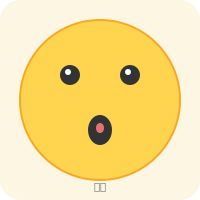
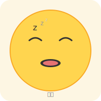
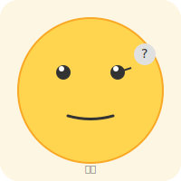
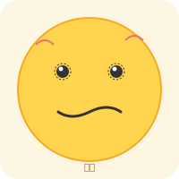
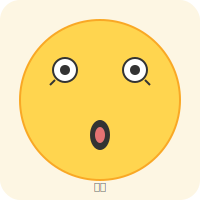
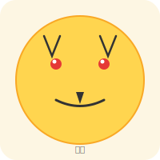
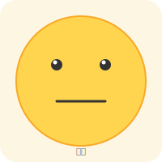

# Emoji Collection 🎭

20 種不同情緒的表情圖案（SVG 格式）。

| # | 情緒 | 檔案 |
|---|------|------|
| 01 | 快樂 | `happy.svg` |
| 02 | 悲傷 | `sad.svg` |
| 03 | 生氣 | `angry.svg` |
| 04 | 驚訝 | `surprised.svg` |
| 05 | 愛睏 | `sleepy.svg` |
| 06 | 戀愛 | `inlove.svg` |
| 07 | 調皮 | `playful.svg` |
| 08 | 耍酷 | `cool.svg` |
| 09 | 恐懼 | `fearful.svg` |
| 10 | 思考 | `thinking.svg` |
| 11 | 大笑 | `laughing.svg` |
| 12 | 痛哭 | `crying.svg` |
| 13 | 沮喪 | `frustrated.svg` |
| 14 | 焦慮 | `anxious.svg` |
| 15 | 震驚 | `shocked.svg` |
| 16 | 擁抱 | `hugging.svg` |
| 17 | 搗蛋 | `devilish.svg` |
| 18 | 天使 | `angelic.svg` |
| 19 | 哀求 | `pleading.svg` |
| 20 | 面癱 | `neutral.svg` |

## 情緒列表

-  **快樂** (`happy.svg`)
-  **悲傷** (`sad.svg`)
-  **生氣** (`angry.svg`)
-  **驚訝** (`surprised.svg`)
-  **愛睏** (`sleepy.svg`)
-  **戀愛** (`inlove.svg`)
-  **調皮** (`playful.svg`)
-  **耍酷** (`cool.svg`)
-  **恐懼** (`fearful.svg`)
-  **思考** (`thinking.svg`)
-  **大笑** (`laughing.svg`)
-  **痛哭** (`crying.svg`)
-  **沮喪** (`frustrated.svg`)
-  **焦慮** (`anxious.svg`)
-  **震驚** (`shocked.svg`)
-  **擁抱** (`hugging.svg`)
-  **搗蛋** (`devilish.svg`)
-  **天使** (`angelic.svg`)
-  **哀求** (`pleading.svg`)
-  **面癱** (`neutral.svg`)
